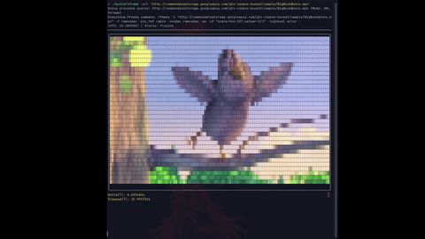

# cframe: Terminal Video Player

Want a little lightweight video streaming / player while you do terminal shit?
Then **cframe** is for you!

---

## Showcase


---

## 🛠️ Dependencies

**cframe** requires the following libraries and tools to be installed on your system:

1.  **FFmpeg:**
2.  **ftxui:** A C++ library for developing terminal user interfaces
3.  **A Modern C++ Compiler:**

---

### Building

```bash
# Clone the repository (if you haven't already)
git clone <your-repo-link>
cd cframe

# Create and enter the build directory
mkdir build
cd build

# Configure CMake (adjust paths if necessary)
cmake ..

# Compile the project
make
```

#### Local File Playback
Provide the path to your local video file.

```bash 
# Play video file
./build/cframe /path/to/your/video.mp4
```

#### URL/Stream Playback

Use the `-u` or `--url` flag to specify that the path is a network stream.

```bash
# Stream a video url
./build/cframe -u https://example.com/live/stream.m3u8
```
